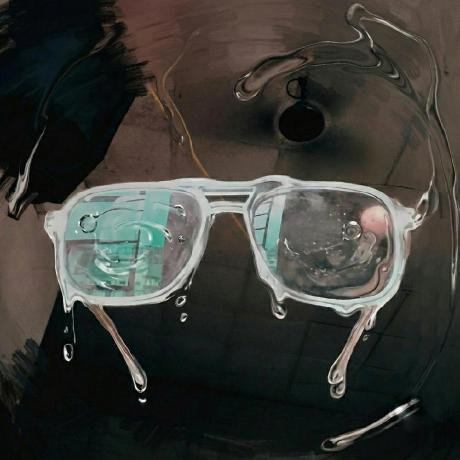

<div align="center">

  

  # Ansil Muhammed N S
  ### *@ClashLex*

  **Engineer · Builder · Open Source**

  *Crafting software, shipping products, and contributing to the open web.*

  ---

  <a href="https://clashlex.github.io/Ansil/">
    
  </a>

  <br/><br/>

</div>

## 🔗 Connect & Links

| Platform | Handle / Link | Description |
| :--- | :--- | :--- |
|  **GitHub** | [`@ClashLex`](https://github.com/ClashLex) | Open source projects & contributions |
|  **Twitter / X** | [`@Claashhhhh`](https://twitter.com/Claashhhhh) | Tech thoughts, updates & builds |
|  **Instagram** | [`@Claashhhhh`](https://instagram.com/Claashhhhh) | Visual journal & everyday moments |
|  **LinkedIn** | [`Ansil Muhammed N S`](https://www.linkedin.com/in/ansil-muhammed-n-s-882449377) | Professional background & network |
|  **GitLab** | [`@ClashLex`](https://gitlab.com/ClashLex) | Enterprise & additional code repos |
| ✚ **Email** | [`ansilmuhammed919@gmail.com`](mailto:ansilmuhammed919@gmail.com) | Direct inquiries & collaborations |

<br/>

## 🛠️ Stack

- **Framework**: [Next.js 16](https://nextjs.org/) — App Router, static export
- **UI**: [React 19](https://react.dev/) & [TypeScript](https://www.typescriptlang.org/) (strict)
- **Animation**: [GSAP](https://gsap.com/) — marquee menu
- **WebGL**: [OGL](https://oframe.github.io/ogl/) — GLSL particle background
- **Audio**: Web Audio API — synthesized UI ticks (no audio assets)
- **Type**: Instrument Serif + Inter via `next/font`
- **Deployment**: GitHub Actions → GitHub Pages (`out/` artifact)

<br/>

## ✨ Features

- **Particle Background** — GPU particle field that reacts to hover and re-tints on theme change.
- **Flowing Menu** — GSAP-driven marquee of social links with staggered entrance animation.
- **Dark Mode** — persisted to `localStorage`, defaults to the OS `prefers-color-scheme`, rendered light-first to avoid hydration mismatch.
- **Custom Cursor** — smoothed trailing cursor that expands over interactive elements; disabled on touch devices.
- **Audio Feedback** — short synthesized tick on link activation.
- **Toasts** — lightweight confirmation messages via React context.
- **Responsive & Accessible** — fluid type, visible focus rings, `prefers-reduced-motion` support.

<br/>

## 💻 Local Development

```bash
# Install dependencies
npm install

# Run dev server
npm run dev

# Static production build → out/
npm run build

# Type-check
npx tsc --noEmit
```

<br/>

## 📁 Structure

```
src/
  app/
    layout.tsx        # Fonts, metadata, global CSS
    page.tsx          # Single route: providers + components
    globals.css       # Design tokens, themes, global utilities
  components/
    ThemeProvider.tsx # Light/dark context + persistence
    DarkModeButton.tsx
    Toast.tsx         # Toast context + renderer
    CustomCursor.tsx
    ThemedBackground.tsx
    Particles.tsx     # OGL WebGL particle field
    LinksSection.tsx  # Social link data + wiring
    FlowingMenu.tsx   # GSAP marquee menu
  lib/
    audio.ts          # Web Audio tick/chime synthesis
public/               # Static assets (served under /Ansil)
```

<br/>

---

<div align="center">
  <sub>Built with Next.js & React · © 2026 Ansil Muhammed N S</sub>
</div>
